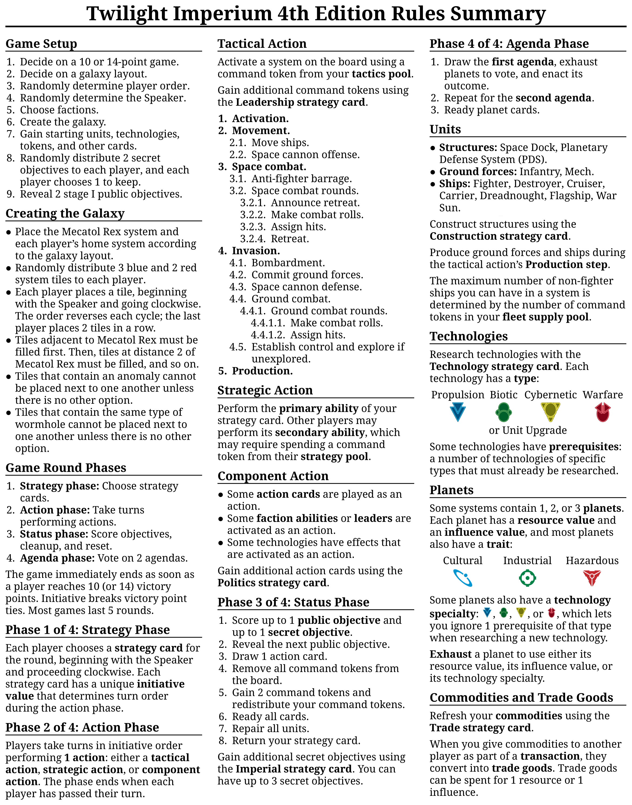
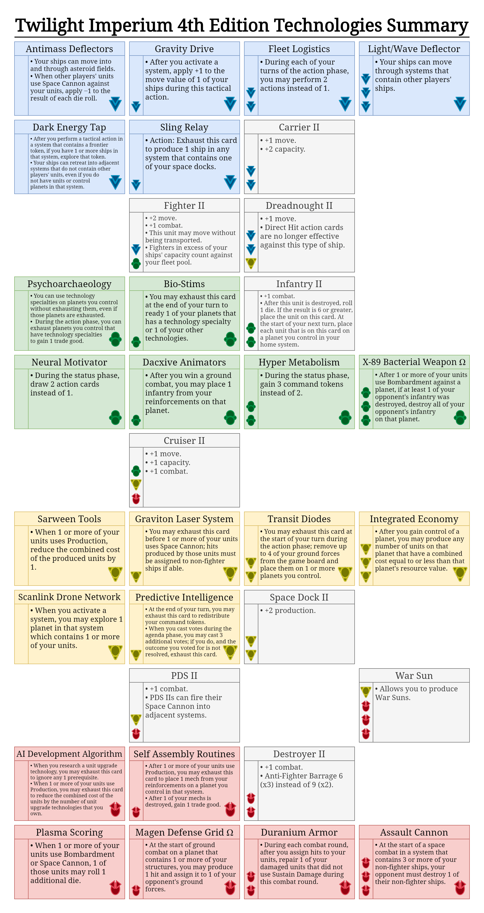

[Official References](#official-references) · [Unofficial References](#unofficial-references) · [Rules Summary](#rules-summary) · [Technologies Summary](#technologies-summary)

# Official References

- [Official Website](https://www.fantasyflightgames.com/en/products/twilight-imperium-fourth-edition)
    - ["Learn to Play" Booklet](https://images-cdn.fantasyflightgames.com/filer_public/f3/c6/f3c66512-8e19-4f30-a0d4-d7d75701fd37/ti-k0289_learn_to_playcompressed.pdf)
    - ["Prophecy of Kings Expansion" Booklet](https://images-cdn.fantasyflightgames.com/filer_public/c4/b9/c4b94e1e-d392-4ef8-a305-a37bb5660be3/ti10_rulebook_web.pdf)
    - ["Living Rules Reference" Booklet](https://images-cdn.fantasyflightgames.com/filer_public/51/55/51552c7f-c05c-445b-84bf-4b073456d008/ti10_pok_living_rules_reference_20_web.pdf)
    - ["Guide to the Imperium" Handbook](https://images-cdn.fantasyflightgames.com/filer_public/b6/d9/b6d969a2-21c2-4b1e-8d6f-ac6fec456b88/guide_to_the_imperium_10_web.pdf)
    - ["Codex Volume I: Ordinian" Booklet](https://images-cdn.fantasyflightgames.com/filer_public/c7/c2/c7c2ac85-8d7a-46f1-a9c0-d633d89865ef/ti_codex_1_rules_compressed.pdf)
    - ["Codex Volume II: Affinity" Booklet](https://images-cdn.fantasyflightgames.com/filer_public/ff/fe/fffe5e9d-33fb-4149-a3a2-cd6dfadb4de3/ti_codex_ii_rules_web.pdf)
- [Wiki](https://twilight-imperium.fandom.com/wiki/Twilight_Imperium_Wiki)
    - [Factions](https://twilight-imperium.fandom.com/wiki/Factions)
    - [Systems and Planets](https://twilight-imperium.fandom.com/wiki/Planets_and_Systems)
    - [Units](https://twilight-imperium.fandom.com/wiki/Units)
    - [Technologies](https://twilight-imperium.fandom.com/wiki/Technology)
    - [Cards, Tokens, and Sheets](https://twilight-imperium.fandom.com/wiki/Player_Components)

[(Back to Top)](#)

# Unofficial References

- [Steam Tabletop Simulator TI4 Mod](https://steamcommunity.com/sharedfiles/filedetails/?id=1288687076)
- [Discord TI4 Server](https://discord.com/invite/X7ERcqPFkn)
- [Reddit TI4 Subreddit](https://www.reddit.com/r/twilightimperium)
- [Space Cats Peace Turtles Podcast](https://spacecatspeaceturtles.com)
- ["How to Play TI4" Video by RTFM](https://www.youtube.com/watch?v=_u2xEap5hBM)
- ["How to Play TI4 Expansion" Video by RTFM](https://www.youtube.com/watch?v=AltGwY-bmfY)
- ["TI4 Review" Video by Shut Up and Sit Down](https://www.youtube.com/watch?v=PLybps39ZwM)

[(Back to Top)](#)

# Rules Summary

[(Back to Top)](#)

# Technologies Summary

[(Back to Top)](#)

The Rules Summary and Technologies Summary are summarized from the Twilight Imperium 4th Edition board game by Fantasy Flight Games and licensed under a [Creative Commons Attribution 4.0 International License](http://creativecommons.org/licenses/by/4.0). The contents, copyrights, and trademarks of everything involving Twilight Imperium 4th Edition are exclusively held by Fantasy Flight Games; I make no claim to any of these in any way.
