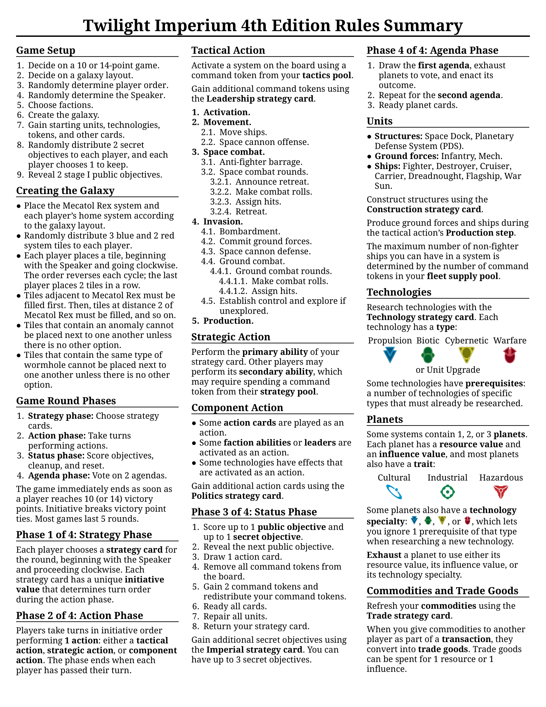
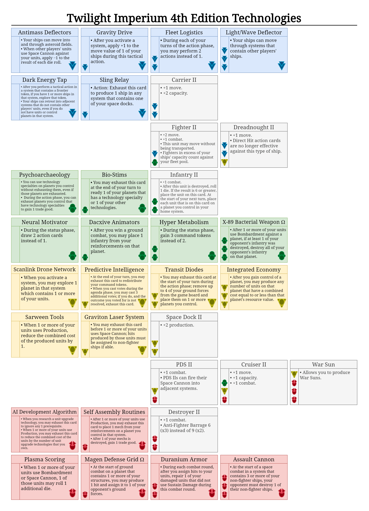

# TI4 Reference
Quick reference sheets for the Twilight Imperium 4th Edition board game.

- [Rules Summary](#rules-summary)
- [Technologies Summary](#technologies-summary)
- [License](#license)

## Rules Summary

[^ Back to Top](#ti4-reference)

## Technologies Summary

[^ Back to Top](#ti4-reference)

## License
This work is based on the Twilight Imperium 4th Edition board game by Fantasy Flight Games. I simply summarize and tabulate their content for ease of use.

My own content is licensed under a [Creative Commons Attribution 4.0 International License][cc-by].

[![CC BY 4.0][cc-by-shield]][cc-by]

[![CC BY 4.0][cc-by-image]][cc-by]

[cc-by]: http://creativecommons.org/licenses/by/4.0/
[cc-by-image]: https://i.creativecommons.org/l/by/4.0/88x31.png
[cc-by-shield]: https://img.shields.io/badge/License-CC%20BY%204.0-lightgrey.svg

Maintainer: Alexandre Coderre-Chabot (<https://github.com/acodcha>)

[^ Back to Top](#ti4-reference)
